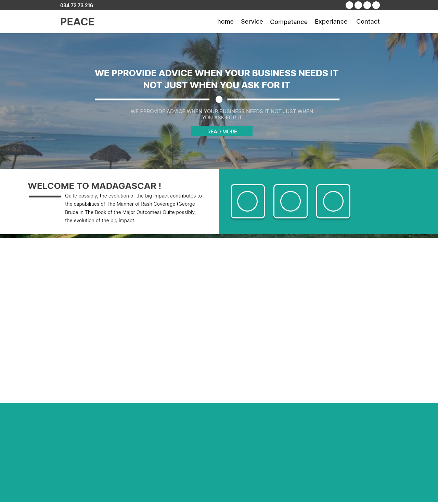
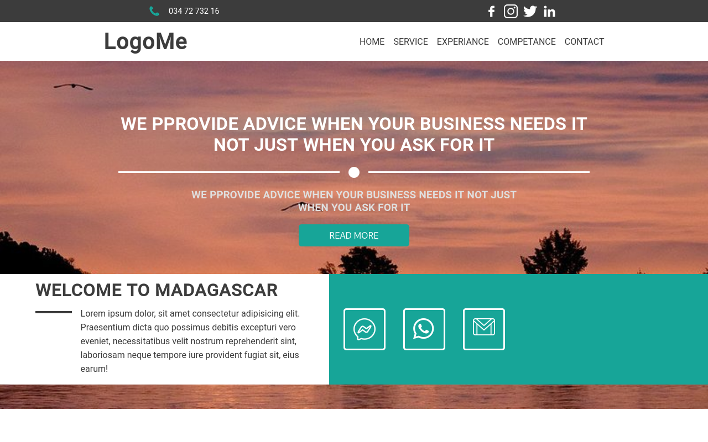
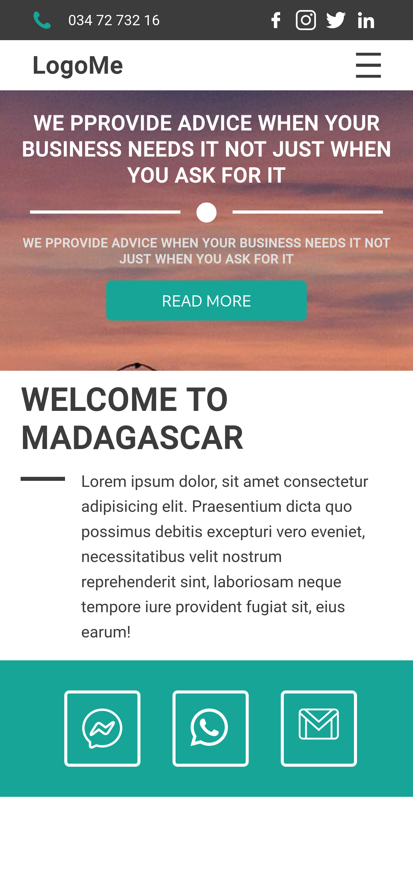

# Rapport de Projet : Header de Site Web Responsive

## Introduction


Ce projet consiste à concevoir et développer un composant **Header responsive** en utilisant **React** pour le développement front-end et **Lunacy** pour la conception UI/UX. Le header s’adapte dynamiquement à toutes les tailles d’écran et intègre un menu hamburger pour les appareils mobiles.

## 🎯 Objectifs du projet

- Créer un composant d’en-tête moderne, clair et responsive
- Suivre une maquette professionnelle conçue avec Lunacy
- Intégrer un menu de navigation fluide avec animation
- Assurer une compatibilité mobile, tablette et desktop,un header moderne et adaptable à tous les écrans.
- Utiliser React pour la structure et la réactivité.
- Styliser avec CSS pour assurer la responsivité.

## Technologies utilisées

- **React** : Gestion des composants et de l’état.
- **HTML/CSS** : Structure et mise en forme responsive (Flexbox, Media Queries).
- **Lunacy** : Création et exportation des icônes et logos personnalisés.

## Étapes de réalisation

1. **Conception graphique** : Réalisation des maquettes et des assets dans Lunacy.
2. **Développement React** :
    - Création du composant `Header`.
    - Intégration des assets exportés.
3. **Mise en page CSS** :
    - Utilisation de Flexbox pour l’alignement.
    - Media Queries pour l’adaptation mobile/tablette.
4. **Tests** : Vérification sur différents navigateurs et tailles d’écran.


## 🧱 Structure du projet

REACT/
├── mon-app/
│   ├── node_module/
│   ├── public/
│   └── src/
|       ├── composant/
|       |    ├── head/
|            |   ├── index.jsx
|       |    |   └──style.css
|       |    └──header/
|       |       ├── index.jsx
|       |       └──style.css
│       |   
│       ├── image/
|       ├──app.css
│       └──app.js
|
├── .gitignore
└── README.md

### Exemple Code source sur head/index.jsx et style.css


```jsx
import "./style.css"
    import facebook from '../../image/facebook(2).png'
    import instagrame from '../../image/instagram(2).png'
    import twitter from '../../image/twitter(1).png'
    import linkedin from '../../image/linkedin(3).png'
    import appel from '../../image/appel-telephonique.png'

    function MyHead (){
        return (
            <>
                <div className="header">
                    <div className="head">
                        <span>  034 72 732 16</span>
                        <div className="nav">
                            <div className="icon"></div>
                            <div className="icon"></div>
                            <div className="icon"></div>
                            <div className="icon"></div>
                        </div>
                    </div>
                </div>
            </>
        )
    }

    export default MyHead
```


``` css
    .header, header{
        /* background-color: #3C3C3C;*/
        justify-content: center;
        display: flex;
        width: 100%;
    }
    .header{
        background-color: #3C3C3C;
        height: 40px;
    }
    .head, nav{
        display: flex;
        justify-content: space-around;
        align-items: center;
        padding: 0 2rem;
        width: 1400px;
    }
    .nav{
        background-color: #3C3C3C;
        display: flex;
    }
    .head span{
        color: white;
        font-size: 0.9rem;
        display: flex;
        align-items: center;
        gap: 1rem;
        cursor: pointer;
    }
```

## 📷 Aperçu visuel

> Maquette réalisée avec Lunacy




## Résultat

Le header est :
- **Responsive** : s’adapte à tous les appareils.
- **Modulaire** : facilement réutilisable dans d’autres projets React.
- **Esthétique** : grâce aux éléments graphiques personnalisés.

> Resultat du code en pc


> Resultat du code en platforme mobile



## Conclusion

Ce projet démontre l’efficacité de React combiné à des outils de design modernes comme Lunacy pour créer des interfaces web attractives et adaptatives.
